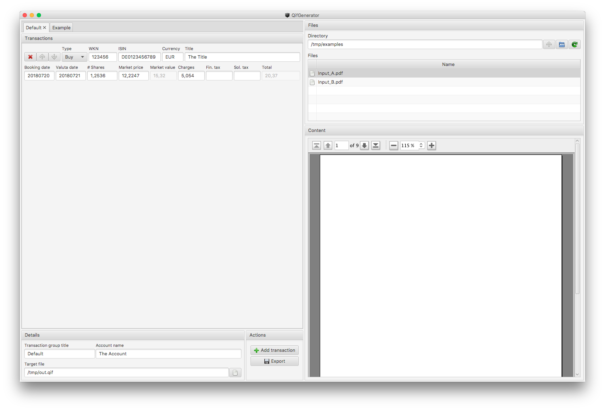

# QIF Generator

Quick solution to allow the generation of a QIF file ([Quicken Interchange Format](https://de.wikipedia.org/wiki/Quicken_Interchange_Format)).

## Building the application

### Generic build

The application is written in pure Java, using a JavaFX frontend. It's therefore platform independent and can be built and run on every platform supporting a Java SDK.

For building it simply checkout the repository from GitHub and call the Maven package target on the command line:

    $ git clone https://github.com/perdian/qifgenerator.git
    $ cd qifgenerator
    $ mvn clean package
    $ java -jar target/qifgenerator.jar

### macOS build

On macOS a simplified build that directly generated a DMG archive from which the application can be installed or distributed can be built using the following commands:

    $ git clone https://github.com/perdian/qifgenerator.git
    $ cd qifgenerator
    $ mvn clean package -Pmacos-bundle
    $ open target/QIF\ Generator.dmg
