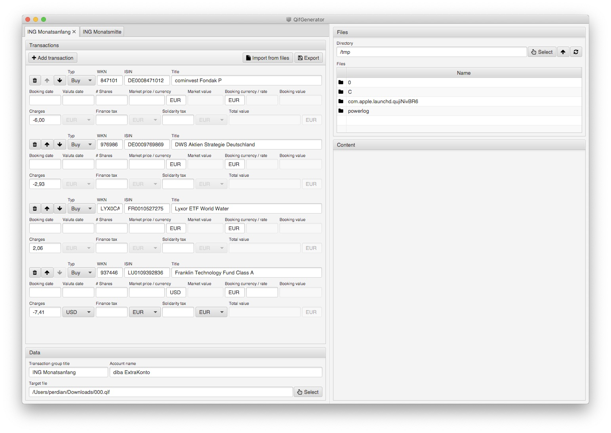

# FimaSu (Finanzmanager Support)

Quick solution to allow the generation of a QIF file ([Quicken Interchange Format](https://de.wikipedia.org/wiki/Quicken_Interchange_Format)).

The idea here is to allow me to make my life easier when adding new stock entries into my Lexware Finanzmanager (formerly Quicken) application.

My old cumbersome process was to download all the PDF files from my bank and then add each and every transaction manually into Quicken.
This task however takes quite some time as it's clicking here, entering data there, clicking here again and so on - overall not very efficient.
But as tje Finanzmanager is able to import QIF files this tool simplifies the task of collecting all the information from the PDF files in an efficient way and then using the generated QIF file as import source within the Finanzmanager.

To achieve this I have a directory containing the downloaded PDF documents from by bank on the right side and the input fields in which the data of the PDF files needs to be entered on the right side.
With PgUp ad PgDn I can then navigate through the PDF files easily without having to use the mouse to scroll, go back to editing and repeating the whole process over and over again.

Yes, the whole application is basically a simplified way to get information from a PDF into the Finanzmanager but it works for me and makes my life a little bit easier.

## Building the application

### Generic build

The application is written in pure Java, using a JavaFX frontend. It's therefore platform independent and can be built and run on every platform supporting a Java SDK.

For building it simply checkout the repository from GitHub and call the Maven package target on the command line:

    $ git clone https://github.com/perdian/fimasu.git
    $ cd fimasu
    $ mvn clean package -Puberjar
    $ java -jar target/fimasu.jar

### macOS build

On macOS a simplified build that directly genrates a macOS application from which the application can be installed or distributed.

Then build the application activate the profile `macos-bundle`:

    $ git clone https://github.com/perdian/fimasu.git
    $ cd fimasu
    $ mvn clean package -Pmacos-bundle
    $ open target/FimaSu.app/Contents/MacOS/JavaLauncher
